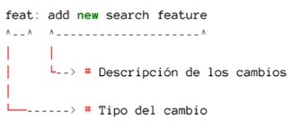

# Curso de Git y Github

---

 <b>Conceptos de Git y Github</b>

## Que es git

>Es un controlador de versiones este es un sistema que registra cada
>cambio que se realiza en el código fuente de un proyecto. Esto
>te permite tener un histórico de todos los cambios producidos
>en sus ficheros, saber quién lo hizo y cuándo.

## Los 3 estados de git
* Modified: Es cuando un archivo ha sido creado, eliminado o modificados.
* Staged: Es cuando el archivo ha sido marcado como  preparado para ser confirmado en el repositorio local.
* Commited: Es cuado el los archivos marcados como preparados son subidos al repositorio local.

## Que es el head
>El head es basicamente decirte estoy aqui.

## Que es un commit
>Son como un punto de guardado como en un videojuego.

## Que es una rama

>Una rama es un snapshot de la division del codigo, en otras palabras son apuntadores que apuntan a un commit.

## ¿Git y GitHub son lo mismo?

>Respuesta corta no, git es un controlador de versione encambio github es servicio de alojamiento en la nube de código fuente basado en el sistema de control de versiones(git).

## Fusionar ramas
>La fusion de dos ramas es cuando integramos los cambios de una rama a otra.

## Porque eliminar una rama?
>Porque es una buena practica ademas se mantiene limpio el espacio de trabajo

## Conflictos en git
>Un conflicto en es cuando git no sabe que cambio debe prevalecer posterior a un merge, lo que requiere que lo resolvamos manualmente.

## Dentro de github podemos encontrar lo siguiente

* Ver mi perfil y mis repositorio: Podemos ver nuestra información de nuestro perfil, repositorios, organizaciones a las que pertenecemos y ver nuestras contribuciones.
* Buscar perfiles, repositorios , etc.: Podemos ver nuestros repositorios y repositorios de otras personas.
* Proyectos: Nos permite ver, crear y gestionar proyectos.
* Organizaciones: Nos permite crear repositorios privados y poder agregar personas a este.
* Repositorios y codigo: Podemos ver archivos de los repositorios publicos y personales, se puede realizar cambios en el código.
* Acciones en los repositorios: Las actions nos permiten automatizar las tareas en nuetro repositorio.

### Para usar un repositorio remoto debemos hacer lo siguiente
* Crear una cuenta en GitHub
* Crear un repositorio local en nuestro ordenador.
* Vincular el repositorio local con el repositorio remoto en GitHub
* Sicronizar nuestros cambios del repositorio local con el repositorio remoto

## Push, pull y pull request

### ¿Que es git push?

>Es un comando que nos permite subir los cambios de nuestro repositorio local a nuestro repositorio remoto. Este se asocia a solo una rama.

### ¿Que es git pull?
>Es un comando que nos permite descargar los cambios de nuestro repositorio remoto a nuestro repositorio local.

### Malas prácticas del git push
>El git push -f o git force push, es una mala práctica porque puede sobreescribir los cambios de otros usuarios en el repositorio remoto.

### Como crear un pull request o PR
>Un pull request es una solicitud de revision y fusión de los cambios de una rama en otra rama que son enviados al repositorio original. Un pull request se puede crear desde la plataforma de GitHub o desde la linea de comandos de git. Se puede hacer pull request con commits pequeños y poder visualizarlos, esto cuenta como una buena práctica.

## Gitglow
>Es un flujo de trabajo ramificado que utiliza varias ramas.

* main o master: Es la rama principal que contiene el código de producción.
* develop: Esta rama de desarrollo donde se realizan los cambios principales.
* features: Estos son caracteristicas nuevas del proyecto.
* release: Estos son cambios de último momento.
* Hotflix: Son parches o arreglar bugs pequeños que son parte del main.

## Github flow
>Es un flujo de trabajo de git mas simple, porque solo utiliza dos ramas.

>Las ramas son las siguientes:
* main: Es la rama principal que contiene el código estable.
* feature: Esta rama es para desarrollar nuevas caracteristicas.

### Trunk Based Development
>Es una estrategia donde se prioriza hacer commits desde la rama principal, en caso de necesitar ramas se hacen PR pequeños para integrarlos lo antes posible.

### Ship/ Show / Ask
* Ship: Son los cambios listos para fusionarse con la rama principal.
* Show: Son los cambios que deben ser revisados po CI antes de fusionarse con la rama principal.
* Ask : Son los cambios que requieren de una PR, antes de ser fusionados.

## Buenas prácticas

## Commits
## ¿Cada cuánto hacer un commit?
>Los commits deben ser pequeños agrupando pequeñas mejoras o acciones.

## ¿Como escribir un buen commit?
>Se debe usar un verbo imperativo.Por ejemplo: "Add", "Feat", etc.
>No se debe usar puntos suspensivos o punto final.
>El commit debe tener como máximo 50 caracteres.
>El commit debe ser claro y especifico.
>Se debe usar un prefijo para los commits y que estos sean más semánticos.

## Ejemplo

## Prefijos para los commits

* **feat**: Nueva característica para el usuario.
* **fix** : Es cuando se arregla un bug que afecta al usuario..
* **perf**: Es para cambios que mejoran el rendimiento del sitio. 
* **build**: Es para cambios en el sistema de build, tareas de despliegue o instalación.
* **ci** : Es para cambios en la integración continua.
* **docs** : Es para cambios en la documentación.
* **refactor**: Es para la refactorización del código como cambios de nombre de variables o funciones.
* **style** : Es para cambios de formato, tabulaciones, espacios o puntos y coma, etc; no afectan al usuario.
* **test** : Este añade tests o refactoriza uno existente.
  
## Ramas
## ¿Como elegir un buen nombre para mi rama?
>Para elegir un buen nombre de la rama, es recomendable usar el nombre de la accion que se va a realizar en la rama.

## ¿Cuándo deshacer cambios?

>Cuando el proyecto deja de funcionar.
>Para recuperar código eliminado.
>Para recuperar archivos eliminados.

## ¿Qué comando debo usar para deshacer un cambio que hice en un archivo?

>Esto depende de si desea deshacer el cambio en todo el commit o solo en el archivo.
>Si desea deshacer el cambio en todo el commit, use git reset soft <commit_id>.
>Si desea deshacer el cambio solo en el archivo, use git checkout -- <commit_id> <archivo> && git checkout HEAD -- <archivo>.

## Comandos destructivos y no destructivos

## Comandos destructivos

>Estos afectan el historial de commits realizados.

>Entre estos tenemos:

- **git rebase**
- **git commit amend**
- **git reset**
- **git push --force**

## Comandos no destructivos
>Trabajan en base al historial sin afectarlo.
>Entre estos tenemos:

- **git checkout**

---

# Comandos utilizados
| Comando                     | Descripción                                                                |
| -------------------------   | -----------------------------------------------------------------          |
| **git init nombre_proyecto**    | Inicia un nuevo repositorio Git.                                           |
| **git status**                | Muestra el estado actual del proyecto.                                     |
| **git add**                   | Agrega todos los archivos al repositorio de Git.                           |
| **git restore --staged**      | Evita que los cambios en el área de preparación se incluyan en el commit.  |
| **git commit**                | Genera un registro del cambio realizado.                                   |
| **git log**                   | Muestra un historial de los commits realizados.                            |
| **git log --online**                   | Muestra un historial de los commits realizados pero la parte que se se hizo commit sin tanto detalle.                            |
| **git commit -amend-m**       | Permite editar el mensaje del commit.                                      |
| **git branch**               | Nos muestra todas las ramas del repositorio actual.                        |
| **git branch rama_nueva**  | Crear una rama este tiene diferentes complementos.                         |
| **git switch rama_nueva**  | Permite cambiar de una rama a otra en nuestro repositorio local.            |
| **git switch -c rama_nueva**  | Permite crear y cambiar de una rama a otra en nuestro repositorio local.            |
| **git checkout rama_nueva**| Cambia la ubicación actual al "nombre_rama" con todos los cambios.         |
| **git branch -a**            | Permite ver a las ramas locales y remotas.                                 |
| **git branch -d rama_nueva**            |Elimina una rama local, solo si ya ha sido fusionada (merged) con tu rama actual o con la rama main.  |
| **git branch -D rama_nueva**            | Es una eliminación forzada.                  |
| **git merge**            | Fusiona los cambios de una rama con otra rama.                  |
| **git diff**            | Sirve para visualizar las modificaciones en los archivos|
| **git remote add alias URL-repositorio-remoto**| Enlaza nuestro repositorio local con nuestro repositorio remoto.|
| **git push alias  main**     | Sicroniza nuestros cambios de mi repositorio local con mi repositorio remoto.|
| **git clone url-repositorio-remoto**| Sirve para clonar un repositorio existente en un nuevo directorio local.|
| **git remote -v**             | Muestra que nuestro repositorio esta enlazado con el repositorio remoto.   |
| **git push origin nombre_rama**| Creamos una rama remota.				                   |
| **git fetch**                 | Actualiza la información entre mi repositorio remoto y local.	           |
| **git remote prune origin**   | Elimina las ramas del repositorio local que ya no se utilizan.	           |
| **git merge**                | Combina los cambios de dos o mas ramas en una sola rama.		   |
| **git push -u**               | Envia los commits locales al repositorio remote y establece la rama como referencia. |
| **git push -d alias rama-remota** | Borrar una rama remota.                                            |
| **git push -f**               | Fuerza un push.                                                            |
| **git push alias rama1 rama2 ramaN** | Enviar los commits locales de una o varias ramas específicas a un repositorio remoto.|
| **git pull**               | Envia los commits locales al repositorio remoto y establece a la rama como referencia. |
| **git pull --all**            | Descarga todos los cambios de todas las ramas remotas y  las fusiona con las del repositorio local. |
| **git flow**                  | Inicializa un repositorio Git con el flujo de trabajo Git Flow.            |